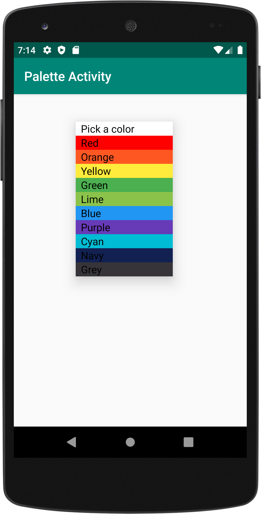
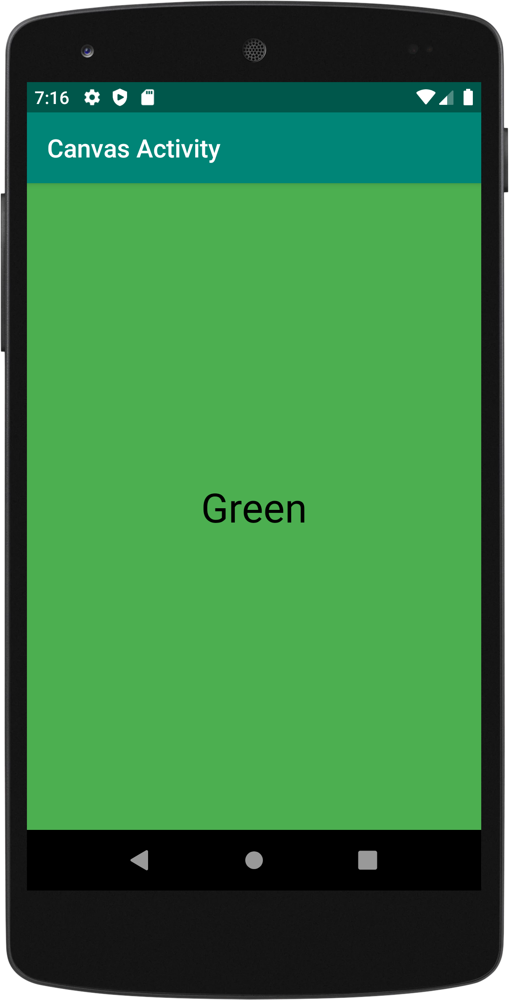
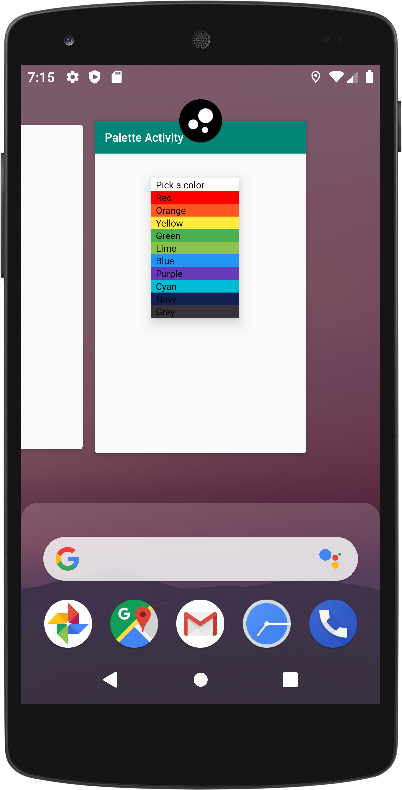

# Pallete Activity (Using Multiple Activities)

**CIS 3515 Introduction to Mobile Application Development - Assignment 4**

This Android application is a 2-activity application along with a custom adapter. The application allows the user 
to select a color from a Spinner on one activity, and once selected, launch the second activity and set the background of 
the new activity’s layout to the selected color. The first activity is called Pallete Activity and the second activity
is called Canvas Activity (this is the new activity that opens when a color is selected as shown in image 1 & 2 below).
The application also has a custom icon (the black and white icon shown in the third image) that I made and a signed APK
has been generate that is ready to be distributed.
 
 
  
